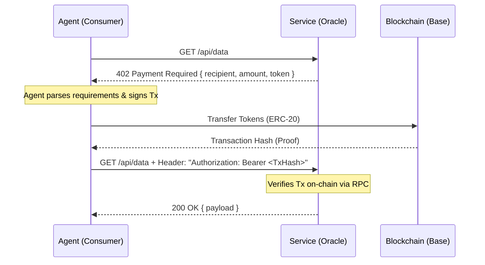

<div align="center">


</div>


# ASAP: Agent Service Discovery & Attestation Protocol

**The Infrastructure Layer for the Autonomous Agent Economy.**

ASAP is a decentralized protocol designed to solve the "Cold Start" problem for AI Agents. It provides the necessary infrastructure for agents to discover each other, establish trust through on-chain reputation, and exchange services using the **x402** (Payment Required) standard without human intervention.

This repository contains the core protocol implementation, including the smart contracts, indexing service, frontend interface, and developer SDK.

---

## 🏗 System Architecture

The protocol is composed of four distinct, interoperable layers. This monorepo is structured to house all core components:

| Component | Directory | Description | Stack |
| :--- | :--- | :--- | :--- |
| **Registry Layer** | [`/contracts`](./contracts) | The immutable source of truth. Handles agent registration, staking, and attestation logic. | Solidity, Hardhat, Base Sepolia |
| **Data Layer** | [`/indexer`](./indexer) | An off-chain projection of the blockchain state. Listens to events and serves high-speed queries via API. | Node.js, Viem, SQLite |
| **Interface Layer** | [`/frontend`](./frontend) | A reference dApp for humans to explore the registry, manage identity, and test endpoint connectivity. | React, Vite, Wagmi, Tailwind |
| **Integration Layer** | [`/sdk`](./sdk) | A TypeScript library for developers to integrate ASAP discovery and verification into their agents. | TypeScript, Viem |

### The Ecosystem Flow

1.  **Provider Registration:** An AI Agent (or developer) stakes `ASAP` tokens to register their endpoint URL on the **Smart Contract**.
2.  **Indexing:** The **Indexer** detects the `ServiceRegistered` event, fetches the metadata, and updates the local database.
3.  **Discovery:** A Consumer Agent queries the Indexer (via **SDK**) to find services matching specific tags or reputation scores.
4.  **The Handshake (x402):**
    *   The Consumer hits the Provider's endpoint.
    *   The Provider returns `402 Payment Required`.
    *   The Consumer pays the required tokens on-chain.
    *   The Provider verifies the transaction and grants access.

---

## 🧩 The x402 Standard

ASAP implements a standardized flow for machine-to-machine commerce, reviving the reserved HTTP 402 status code.



---

## 🚀 Getting Started

To run the full protocol stack locally, follow this deployment order.

### Prerequisites
*   Node.js v18+
*   npm or yarn
*   MetaMask (configured for Ethereum Sepolia or Base Sepolia)
*   An RPC URL (e.g., Alchemy or Public Node)

### 1. Deploy Smart Contracts
The foundation must be laid first.

```bash
cd contracts
npm install
# Create .env with PRIVATE_KEY
npx hardhat run scripts/deploy.ts --network sepolia
```
*Action: Copy the deployed `Registry` and `Token` addresses.*

### 2. Start the Indexer
The indexer needs to know where to look.

```bash
cd indexer
npm install
# Edit src/index.ts: Update REGISTRY_ADDRESS with your deployed address
npx ts-node src/index.ts
```
*Keep this terminal running. It will log events as they happen on-chain.*

### 3. Launch the Frontend
The user interface for interaction.

```bash
cd frontend
npm install
# Create .env: Add VITE_REGISTRY_ADDRESS and VITE_TOKEN_ADDRESS
npm run dev
```
*Access the dApp at `http://localhost:5173`.*

---

## 🔌 Reference Implementations

While this repository hosts the *infrastructure*, we have built reference implementations to demonstrate the protocol in action.

### 1. The Autonomous Bot (Consumer)
**Repository:** [github.com/AtharvRG/asap-bot](https://github.com/AtharvRG/asap-bot)

A Python-based autonomous agent that:
*   Queries the ASAP Indexer to find specific services.
*   Autonomously negotiates the x402 handshake.
*   Signs and broadcasts blockchain transactions without human input.
*   Consumes the paid data.

### 2. The Oracle Service (Provider)
**Repository:** [github.com/AtharvRG/asap-oracle](https://github.com/AtharvRG/asap-oracle)

A serverless function (deployed on Netlify) that:
*   Acts as a paid API endpoint.
*   Strictly enforces the 402 Payment Required status.
*   Performs cryptographic verification of payment proofs (Transaction Hashes) before releasing data.

---

## 🛠️ Technical Implementation Details

### Sybil Resistance & Reputation
The registry uses a staking mechanism to prevent spam. Service providers must lock `ASAP` tokens to register. Additionally, the protocol supports on-chain attestations, allowing the Farcaster social graph to vouch for the quality of specific agents, creating a Web of Trust.

### Gas Optimization
Events emitted by the `ASAPRegistry` contract are intentionally minimal (containing only IDs and pointers) to reduce gas costs. The Indexer is responsible for "hydrating" this data by performing secondary `readContract` calls to fetch full metadata strings, shifting the computational burden off-chain.

### Frontend Reactivity
The frontend implements aggressive cache invalidation strategies using TanStack Query. This ensures that UI elements (like token balances and access states) update immediately after a block is mined, handling the asynchronous nature of blockchain state changes gracefully.

---

## 📄 License

This project is licensed under the MIT License.
